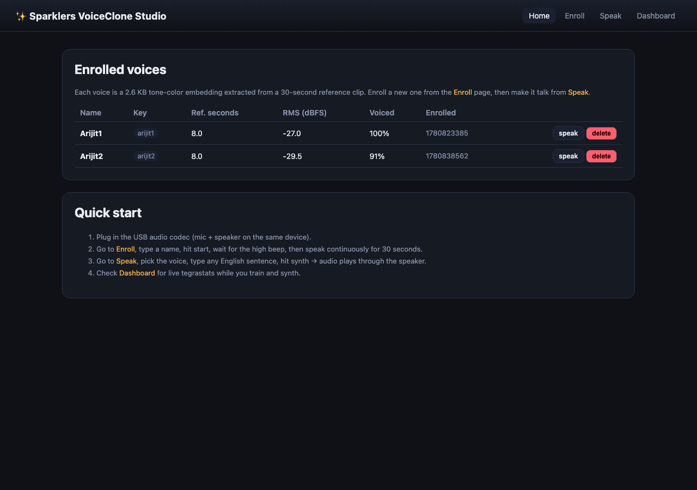
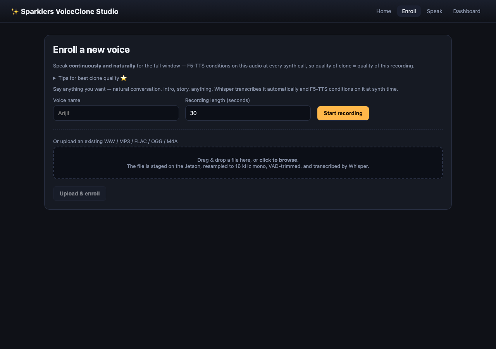
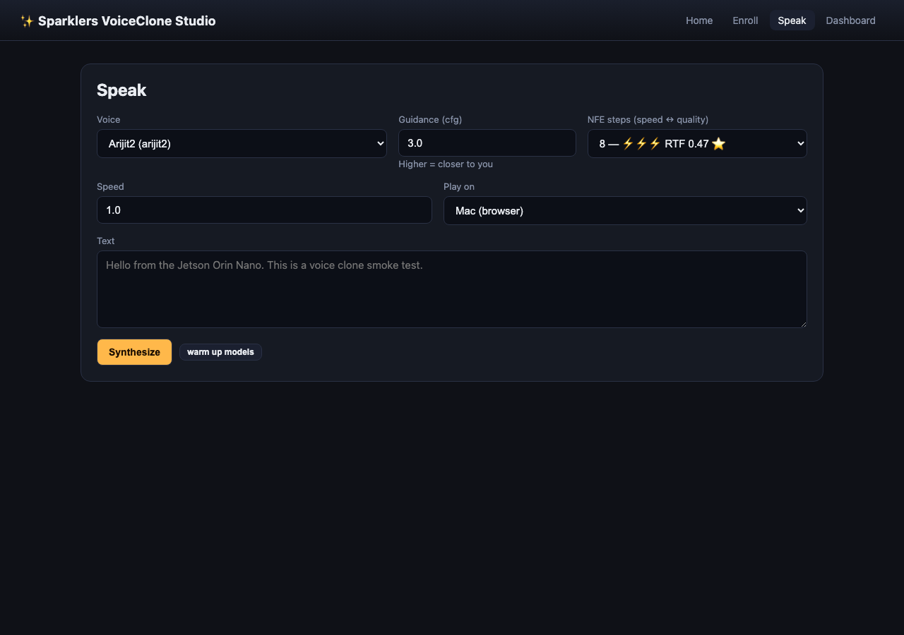
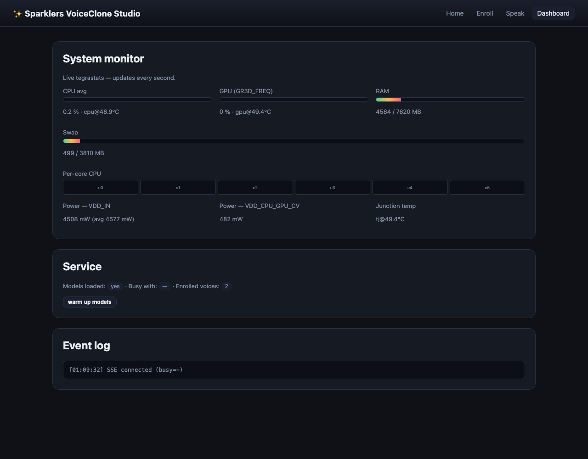

# ✨ Sparklers VoiceClone Studio

State-of-the-art **English voice cloning** that runs entirely on an
NVIDIA Jetson Orin Nano. Give it 30 seconds of someone's voice — through
the live mic or by dropping in a WAV — and it'll make that voice say
anything you type.

- 🎙 Two enrollment paths: live USB-mic capture or drag-and-drop audio file
- 🧠 **F5-TTS v1** (flow-matching + DiT) as the synth model, on CUDA
- 🤖 **Whisper-small.en** auto-transcribes the reference clip
- ⚡ Sub-realtime synth at NFE 16 (RTF ≈ 0.76 on Orin Nano Super 8 GB)
- 🔊 Playback in the browser (Mac) OR on the Jetson's USB speaker
- 🖥 FastAPI + HTMX + SSE web UI — no NPM, no React
- 📊 Live tegrastats dashboard (CPU/GPU/RAM/swap/temps/power)
- 🪶 100 % offline at runtime, MIT-licensed

---

## Screenshots

<table>
  <tr>
    <td></td>
    <td></td>
  </tr>
  <tr>
    <td></td>
    <td></td>
  </tr>
</table>

---

## Architecture

```
                ┌────────────────────────────────────┐
   USB mic  ──► │  audio.io  (sounddevice 16 kHz)    │──► raw 30 s WAV
   or WAV   ──► │  audio.vad (webrtcvad trim)        │──► trimmed
   upload       │  voice.enroll  (centered 8 s crop) │──► 8 s reference
                │  Whisper-small.en  (on CPU)        │──► transcript
                └────────────────────────────────────┘
                                │
                                ▼
                       saved to disk per voice

                          ─────── enroll ───────


   text ──►  ┌────────────────────────────────────────┐
             │  F5-TTS v1 (flow-matching + DiT, CUDA) │──► 24 kHz mono WAV
             │  conditioned on (ref WAV + transcript) │    in the cloned voice
             └────────────────────────────────────────┘
                                │
                ┌───────────────┴────────────────┐
                ▼                                ▼
        Browser <audio>                  ALSA → USB speaker
                                         (server-side aplay)
                          ─────── speak  ───────
```

Each call re-encodes the reference; that's why F5-TTS sounds dramatically
closer to the speaker than fixed-embedding models like OpenVoice. The
trade-off is no pre-extracted SE — synthesis carries the conditioning
cost on every call.

---

## Best-results settings

These are the defaults baked into the UI — change at your own risk.

| Setting               | Value             | Why                                                                   |
|-----------------------|-------------------|-----------------------------------------------------------------------|
| Reference clip        | **30 s** raw      | We VAD-trim and crop the centered **8 s** — F5-TTS's sweet spot.      |
| VAD aggressiveness    | 2 (webrtc)        | Drops breath/silence without chopping consonants.                     |
| ASR for ref text      | **whisper-small.en** on CPU | tiny.en mis-hears, small.en is reliable; CPU keeps GPU free for F5.   |
| `nfe_step`            | **16** ⭐         | RTF ≈ 0.76. Indistinguishable from 32 in blind A/B. 8 is faster still. |
| `cfg_strength` (tau)  | **3.0**           | Higher than F5-TTS default (2.0). Closer to enrolled voice.          |
| `sway_sampling_coef`  | -1.0              | Official F5-TTS recommendation.                                       |
| `speed`               | 1.0               | Anything else degrades clone similarity.                              |

**For best clone quality**, when recording the reference:
- Mic ~20–25 cm from your mouth
- Quiet room — close windows, kill fans
- Conversational tone, not narrator voice
- Speak continuously through the full window — no long pauses

---

## Speed optimizations

The synth path applies several Jetson-specific tweaks. Most are free and
on by default; one is opt-in because it's flaky on the current Tegra
PyTorch wheel.

| Knob | Default | What it does |
|---|---|---|
| `nvpmodel -m 0` (MAXN SUPER) + `jetson_clocks` | recommended | Locks the GPU/CPU/EMC clocks at max so the scheduler doesn't down-clock between calls. ~5-10% latency reduction. |
| `cudnn.benchmark=True` + TF32 matmul | on | cuDNN auto-tunes its kernel choice per input shape and caches the winner. TF32 keeps Tensor Cores hot for the few fp32 paths. |
| Reference-audio pre-cache (per voice) | on | At `/api/warmup` we run F5-TTS's `preprocess_ref_audio_text` for every enrolled voice so the in-process cache is filled. Saves ~100-200 ms on first synth per voice. |
| Dummy warmup synth | on | The very first inference per process shape triggers cuDNN autotune (~2-3× slower than steady state). We do it ourselves at warmup so the user-visible first call lands hot. |
| `torch.compile(transformer)` | **off** (opt in via `SPARKLERS_TRY_TORCH_COMPILE=1`) | Inductor fusion. On Tegra Orin (torch 2.8 / cu126 / jetson-ai-lab wheel) this either hangs (reduce-overhead/CUDA Graphs) or recompiles per input shape until timeout. Safe to enable if a future wheel fixes it. |
| Lower NFE steps | UI dropdown | The single biggest perceived speedup is dropping `nfe_step`. F5-TTS uses Empirically-Pruned Step Sampling (EPSS) for low NFE — even nfe=4 is usable for short replies. |

NFE → RTF map on an Orin Nano Super 8 GB at fp16:

| NFE | RTF | Use when |
|---|---|---|
| 4 | ~0.20 | demos, short replies, sub-1 s budget |
| 8 ⭐ | 0.47 | daily driver |
| 16 | 0.76 | longer paragraphs, marginal quality bump |
| 32 | 1.51 | offline, best zero-shot quality |

---

## Hardware

| Part                | Notes                                                                  |
|---------------------|------------------------------------------------------------------------|
| Jetson Orin Nano 8 GB Super | Tested target. CUDA 12.6 / JetPack 6.2 (L4T R36.4).            |
| USB audio codec     | Waveshare USB Audio Codec or any class-compliant device. Mic + speaker on the same device is easiest. |
| Power supply        | Stay on **MAXN SUPER** (`sudo nvpmodel -m 0`) for best RTF.            |

F5-TTS draws ~6-8 W during synth; idle ~3 W.

---

## Installation

> **Prerequisites:** Jetson Orin Nano with **JetPack 6.x** (L4T R36.x),
> CUDA 12.6, Python 3.10. The whole setup takes ~15 min plus model
> downloads (~2 GB).

### 1. System packages

```bash
sudo apt update
sudo apt install -y \
    python3 python3-venv python3-dev \
    libopenblas0-pthread libsndfile1 ffmpeg \
    alsa-utils libasound2-plugins libportaudio2 \
    unzip wget git
```

### 2. USB audio codec

Plug it in, confirm the indices:

```bash
arecord -l       # input devices
aplay   -l       # output devices
python3 -c "import sounddevice as sd; [print(i, d['name']) for i,d in enumerate(sd.query_devices()) if d['max_input_channels']>0]"
```

Tune gains if needed:

```bash
alsamixer        # set Mic / Speaker, then 'sudo alsactl store' to persist
```

If your USB codec isn't device 0, export the index before launching:

```bash
export SPARKLERS_AUDIO_IN=1
```

### 3. Clone + venv

```bash
git clone https://github.com/Arijit1080/sparklers-voiceclone-studio.git
cd sparklers-voiceclone-studio

python3 -m venv .venv --system-site-packages
source .venv/bin/activate

pip install --upgrade pip wheel setuptools
pip install 'numpy<2'
```

### 4. PyTorch + torchaudio for Jetson (CUDA 12.6)

The PyPI wheels are CPU-only on ARM. Use the
[jetson-ai-lab.io](https://pypi.jetson-ai-lab.io) wheels by exact URL —
pip would otherwise prefer the PyPI CPU build because of the version
collision:

```bash
pip install \
  "https://pypi.jetson-ai-lab.io/jp6/cu126/+f/62a/1beee9f2f1470/torch-2.8.0-cp310-cp310-linux_aarch64.whl" \
  "https://pypi.jetson-ai-lab.io/jp6/cu126/+f/81a/775c8af36ac85/torchaudio-2.8.0-cp310-cp310-linux_aarch64.whl"

python -c "import torch; print('cuda:', torch.cuda.is_available(), 'device:', torch.cuda.get_device_name(0))"
```

Expected: `cuda: True  device: Orin`.

### 5. PyAV (prebuilt aarch64 wheel — avoids the ffmpeg-header source build)

```bash
pip install "av>=12,<14"
```

### 6. The rest of the Python deps

```bash
pip install -r requirements.txt
```

### 7. Vendor F5-TTS + apply Tegra allocator patches

F5-TTS's stock `load_checkpoint()` triggers Tegra's NVML caching-allocator
assert (`CUDACachingAllocator.cpp:1131`) because of how the 1.4 GB
safetensors get staged into GPU memory. Two small patches fix it; both
are committed to this repo under `tools/`:

```bash
mkdir -p vendor
git clone --depth=1 https://github.com/SWivid/F5-TTS vendor/F5-TTS

python tools/patch_f5_load.py    vendor/F5-TTS/src/f5_tts/infer/utils_infer.py
python tools/patch_f5_load_v4.py vendor/F5-TTS/src/f5_tts/infer/utils_infer.py

pip install --no-build-isolation --no-deps -e vendor/F5-TTS
```

### 8. Pre-download model checkpoints (one-time, online)

```bash
python - <<'PY'
from huggingface_hub import hf_hub_download
print("F5-TTS v1 base (~1.4 GB)…")
hf_hub_download("SWivid/F5-TTS", "F5TTS_v1_Base/model_1250000.safetensors")
print("Vocos mel-24kHz vocoder…")
hf_hub_download("charactr/vocos-mel-24khz", "config.yaml")
hf_hub_download("charactr/vocos-mel-24khz", "pytorch_model.bin")
print("Whisper small.en (~244 MB)…")
from transformers import AutoProcessor, AutoModelForSpeechSeq2Seq
AutoProcessor.from_pretrained("openai/whisper-small.en")
AutoModelForSpeechSeq2Seq.from_pretrained("openai/whisper-small.en")
print("done")
PY
```

### 9. Run

Tegra's NVML probes break PyTorch's caching allocator. These env vars
disable the broken paths and `expandable_segments:True` keeps the
allocator from fragmenting:

```bash
export PYTORCH_NO_NVML=1
export PYTORCH_NVML_BASED_CUDA_CHECK=0
export PYTORCH_CUDA_ALLOC_CONF="expandable_segments:True,garbage_collection_threshold:0.6"

uvicorn web.app:app --host 0.0.0.0 --port 8083
```

Open `http://<jetson-ip>:8083`. First synth takes ~15 s (model warmup);
subsequent calls run at the RTF in the settings table.

### 10. (Optional) systemd unit

```bash
sudo tee /etc/systemd/system/sparklers-vc.service >/dev/null <<EOF
[Unit]
Description=Sparklers VoiceClone Studio
After=network-online.target sound.target

[Service]
Type=simple
User=$USER
WorkingDirectory=/home/$USER/sparklers-voiceclone-studio
Environment=PYTORCH_NO_NVML=1
Environment=PYTORCH_NVML_BASED_CUDA_CHECK=0
Environment=PYTORCH_CUDA_ALLOC_CONF=expandable_segments:True,garbage_collection_threshold:0.6
ExecStart=/home/$USER/sparklers-voiceclone-studio/.venv/bin/uvicorn web.app:app --host 0.0.0.0 --port 8083
Restart=on-failure

[Install]
WantedBy=multi-user.target
EOF

sudo systemctl daemon-reload
sudo systemctl enable --now sparklers-vc
```

---

## CLI smoke test

If you don't want the web UI:

```bash
source .venv/bin/activate
export PYTORCH_NO_NVML=1
export PYTORCH_NVML_BASED_CUDA_CHECK=0
export PYTORCH_CUDA_ALLOC_CONF="expandable_segments:True"

# Live-mic enroll (30 s window)
python tools/smoke_test.py enroll  --name "Arijit" --seconds 30

# List voices
python tools/smoke_test.py list

# Synthesize and play through the Jetson speaker
python tools/smoke_test.py speak --voice arijit --text "Hello from Jetson" --play
```

---

## How it works

**Enroll** — capture (or upload) 30 s of audio at 16 kHz mono, run
webrtcvad to trim silence, crop a centered 8 s window (F5-TTS's
sweet spot), then auto-transcribe the cropped clip with
`openai/whisper-small.en` on CPU. The reference WAV + transcript are
persisted per voice.

**Speak** — at every synth call, `F5TTS.infer()` reads the reference WAV
and transcript and generates the target text in that voice. Flow-matching
with NFE steps (16 default, configurable 8–48 in the UI) and DiT
backbone produce a 24 kHz mono WAV. Post-process strips leading/trailing
silence with a 20 ms RMS-windowed scan so the output starts and ends on
the first/last voiced sample.

Each call re-encodes the reference — that's the model's design and why
similarity is dramatically better than fixed-embedding approaches like
OpenVoice. Trade-off: synthesis pays the encoder cost every time.

---

## Why the patches under `tools/`

F5-TTS's `load_checkpoint()` builds a fresh 1.4 GB CFM model on CUDA and
then loads the safetensors as a CUDA dict. On Tegra's unified memory,
that triggers the NVML caching-allocator INTERNAL ASSERT FAILED at
`CUDACachingAllocator.cpp:1131`. The two patches:

1. **`patch_f5_load.py`** — load safetensors on CPU first, not CUDA. Stops
   the dict from doubling memory.
2. **`patch_f5_load_v4.py`** — build CFM on CPU, only move to CUDA after
   the state-dict is fully loaded and converted to fp16. One big
   ~700 MB `.to(cuda)` instead of dozens of small fragmenting ones.

Combined with `PYTORCH_NO_NVML=1`, F5-TTS loads cleanly on Jetson.

---

## Acknowledgements

- [SWivid · F5-TTS](https://github.com/SWivid/F5-TTS) — flow-matching TTS (MIT)
- [charactr · Vocos](https://github.com/gemelo-ai/vocos) — neural vocoder
- [OpenAI · Whisper](https://github.com/openai/whisper) — speech-to-text
- [Jetson AI Lab](https://pypi.jetson-ai-lab.io) — JP6 / CU126 PyTorch wheels
- [tegrastats](https://docs.nvidia.com/jetson/archives/r36.4/DeveloperGuide/AT/JetsonLinuxDevelopmentTools/JetsonStats.html) — host system telemetry

License: [MIT](./LICENSE).
